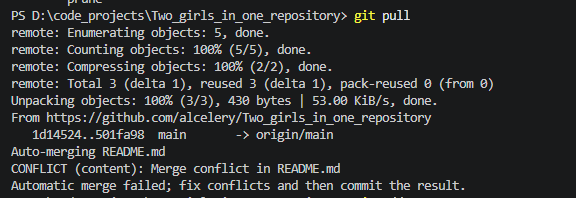
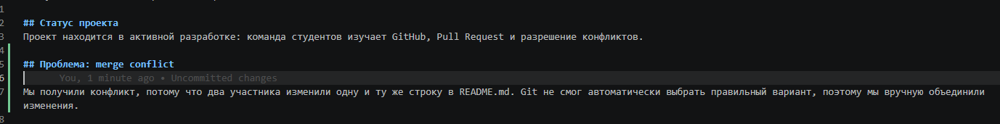
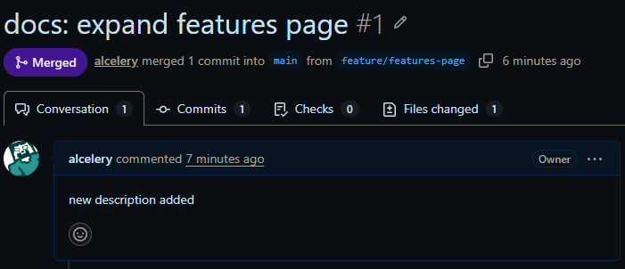
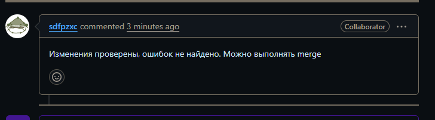
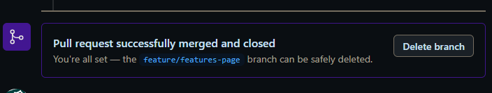
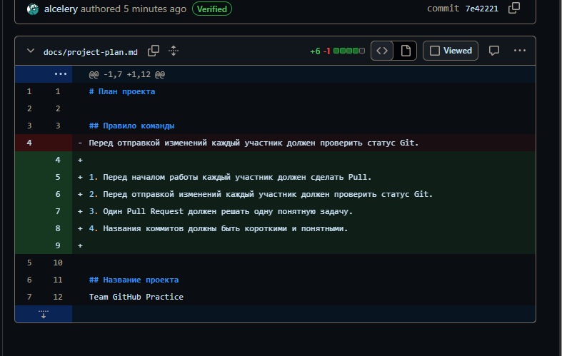
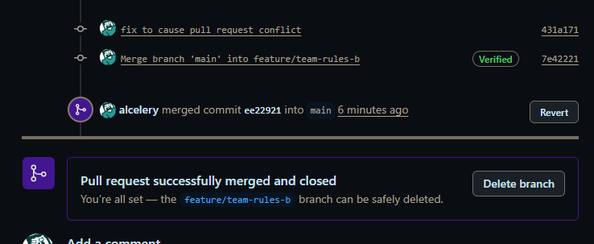

# Two_girls_in_one_repository

 ## Используемые инструменты
 
- Git;
- GitHub;
- VS Code.

## Описание
Это учебный командный проект для практики GitHub.

## Статус проекта
Проект находится в активной разработке: команда студентов изучает GitHub, Pull Request и разрешение конфликтов.

## Проблема: merge conflict

Мы получили конфликт, потому что два участника изменили одну и ту же строку в README.md. Git не смог автоматически выбрать правильный вариант, поэтому мы вручную объединили изменения.

### Рис. 1 Добавление участников в репозиторий

### Рис. 2 Скриншоты открытых проектов участников

### Рис. 3 Первый push

### Рис. 4 Скриншот получения изменений

### Рис. 5 Скриншот истории коммитов

### Рис. 6 Отверженеие коммита 

### Рис. 7 Конфликт слияния 

### Рис. 8 Конфликт слияния решен

### Рис. 9 Создание пулл риквеста

### Рис. 10 Проверка пулл риквеста

### Рис. 11 Слияние пулл риквеста с мейн веткой

### Рис. 12 Конфликт пкулл риквеста (НЕ ВЫШЛО СДЕЛАТЬ ПОТОМУ ЧТО НАДРО РАНЬШЕ ПИСАТЬ ТЧО НУЖЕН СКРИНШОТ КОНФЛИКТА А НЕ В КОЦНЕ САМОГО ПУНКТА)

### Рис. 13 Решенный конфликт пулл риквеста
