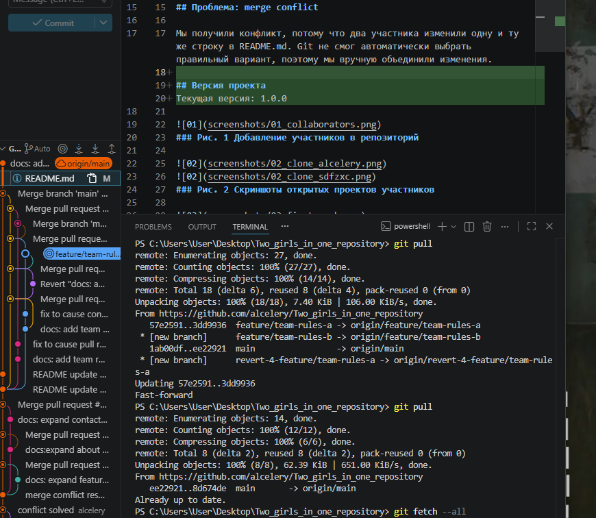

# Two_girls_in_one_repository

## Состав команды
| Участник | GitHub | Роль |
|---|---|---|
| Кошина Александра Олеговна | alcelery | Владелец репозитория, Разработчик |
| Геращенко Ксения Игоревна | sdfpzxc | Разработчик, Проверяющий |

## Цель работы
Практика работы в команде.

 ## Используемые инструменты
 
- Git;
- GitHub;
- VS Code.

## Описание
Это учебный командный проект для практики GitHub.

## Статус проекта
Проект находится в активной разработке: команда студентов изучает GitHub, Pull Request и разрешение конфликтов.

## Проблема: merge conflict

Мы получили конфликт, потому что два участника изменили одну и ту же строку в README.md. Git не смог автоматически выбрать правильный вариант, поэтому мы вручную объединили изменения.

## Версия проекта
Текущая версия: 1.0.0

# Разница между Fetch и Pull
Fetch позволяет увидеть, что на GitHub появились новые изменения, но не 
применяет их сразу к локальным файлам. Pull получает изменения и сразу 
объединяет их с текущей рабочей версией.

## Ход работы

### Рис. 1 Добавление участников в репозиторий

### Рис. 2 Скриншоты открытых проектов участников

### Рис. 3 Первый push

### Рис. 4 Скриншот получения изменений

### Рис. 5 Скриншот истории коммитов

### Рис. 6 Отверженеие коммита 

### Рис. 7 Конфликт слияния 

### Рис. 8 Конфликт слияния решен

### Рис. 9 Создание пулл риквеста

### Рис. 10 Проверка пулл риквеста

### Рис. 11 Слияние пулл риквеста с мейн веткой

### Рис. 12 Конфликт пкулл риквеста (НЕ ВЫШЛО СДЕЛАТЬ ПОТОМУ ЧТО НАДРО РАНЬШЕ ПИСАТЬ ТЧО НУЖЕН СКРИНШОТ КОНФЛИКТА А НЕ В КОЦНЕ САМОГО ПУНКТА)

### Рис. 13 Решенный конфликт пулл риквеста

### Рис. 14 После Fetch

## Ответы на контрольные вопросы
1. Это хранилище кода с историей изменений.
2. Локальный репозиторий храниться 
3. Скачивает изменения с сервера и объеденяет с веткой.
4. Отправление свох изменений на сервер. 
5. Только скачиваение изменений, но не объеденение их с веткой. 
6. Это другая линиия разработки, изолированная от main.
7. Потому что можно сломать стабильную версию, мешать другим и сложно тестировать новое.
8. Запрос на вливание твоих изменений в чужую ветку. 
9. Чтобы найти ошибки, улучшить код и сохранить качество. 
10. Ситуация, когда Git не может автоматически объединить изменения из-за противоречий.
11. Когда в одних и тех же строках файла сделаны разные правки в разных ветках.
12. Обсудить с командой, разобраться, чей код актуальнее, или объединить оба варианта вручную.
13. Можно получить конфликт при Push, потому что ветка устарела.
14. Их легче понять, откатить и проверять каждое изменение.
15. Самое сложное было делать скриншоты, т.к. многие из них уже не можно былоо сделать. Конечно, основная проблема была с конфликтами, но также было не понятно какая структура README все таки нужна. На паре вы говорите одно, а в файле другое. 