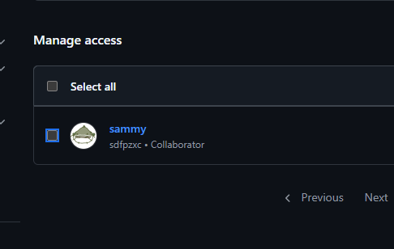
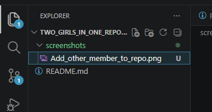
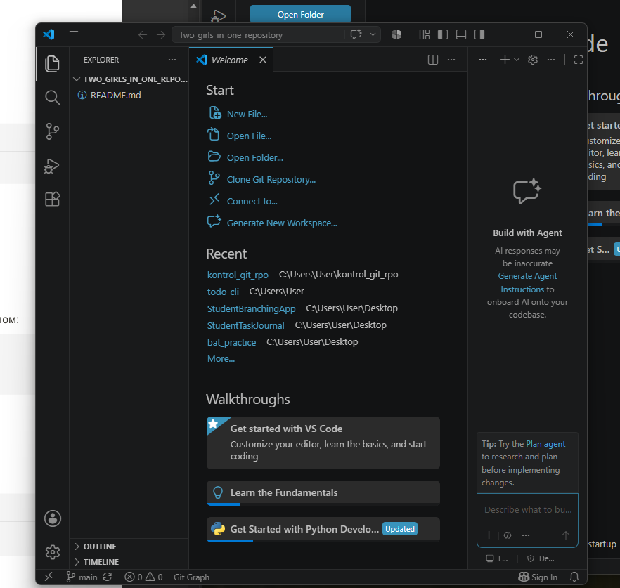
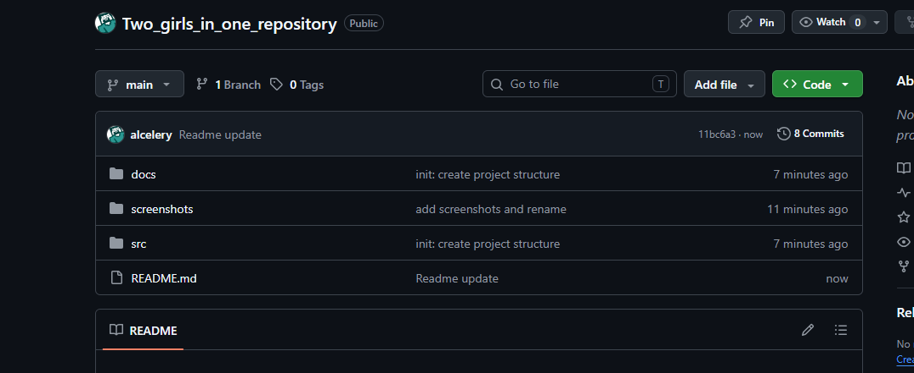
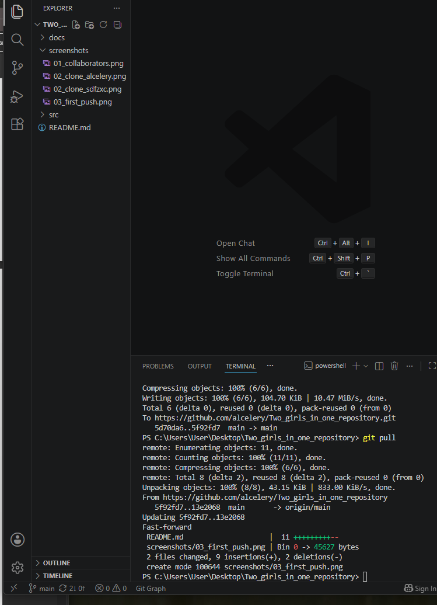

# Two_girls_in_one_repository

<<<<<<< HEAD
 ## Используемые инструменты
 
- Git;
- GitHub;
- VS Code.

=======
## Описание
Это учебный командный проект для практики GitHub.
>>>>>>> 535ea11da55b4f008f0e71dc0a32844ae48ab9d4

### Рис. 1 Добавление участников в репозиторий

### Рис. 2 Скриншоты открытых проектов участников

### Рис. 3 Первый push

### Рис. 4 Скриншот получения изменений