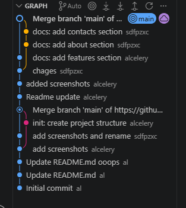
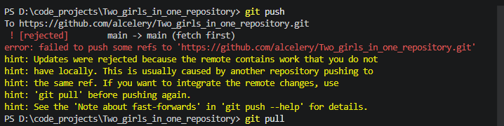

# Two_girls_in_one_repository

 ## Используемые инструменты
 
- Git;
- GitHub;
- VS Code.

## Описание
Это учебный командный проект для практики GitHub.

### Рис. 1 Добавление участников в репозиторий

### Рис. 2 Скриншоты открытых проектов участников

### Рис. 3 Первый push

### Рис. 4 Скриншот получения изменений

### Рис. 5 Скриншот истории коммитов

### Рис. 6 Отверженеие коммита 